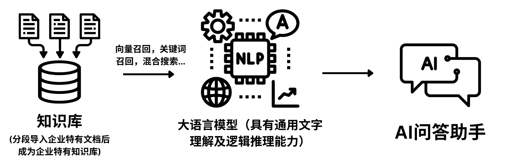
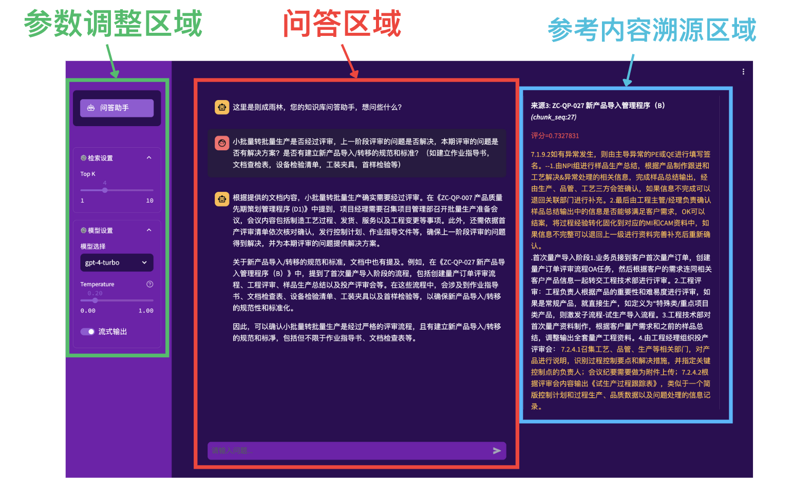
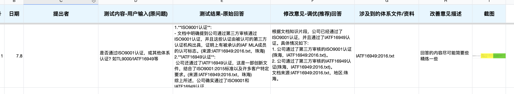

# 1. 项目简介

**则成雨林-体系文件问答助手**是一款基于企业特有知识储备（例：体系文件）的人工智能问答助手。其利用**向量召回**和**关键词召回**两种方式匹配相关文档，而后利用**大语言模型**的通用文字理解及逻辑推理能力来理解整合信息并做出答复。

# 2. 测试使用说明

## - 登录界面：

填入账号密码，点击登录Log in按钮

- 账号 Username：intflex
- 密码 Password：intflex123

## - 操作界面：

操作界面共分为三个区域：

- 参数调整区域
- 问答区域
- 参考内容溯源区域

### a. 参数调整区域

- ***Top K***：最终使用***K***个段落来作为参考文献【即混合搜索结果中的参考文献段落数量】。***K***越大，助手可以获取越多的参考文献片段，但是相对应的响应速度会变慢同时可能会有部分不相关的内容进行干扰。通常4至6的范围较为合理。
- ***模型选择***：使用的基座大语言模型，具有通用文字理解及逻辑推理能力，一般版本越高的模型理解和整合信息的能力越强。
- ***Temperature***：大语言模型自身的稳定性参数。取值范围0-1，越接近0则稳定性相对越高，反之亦然。
- ***流式输出***：输出以流式输出形式一个字接着一个字呈现，关闭则是完整化输出。

### b. 问答区域

- 上方为沟通记录窗口。有雨林问答助手和用户自身两个角色。可以使用鼠标滚轮进行聊天窗口上下滑动。

- 下方为输入窗口。输入完内容后点击右侧箭头即可发送，等待智能助手生成答复。

### c. 参考内容溯源区域

- ***问题分析结果***：将输入拆解分析后的分点。依据语境分拆输入至每一项问题，对于每一项问题都提取其中的关键词并进行展示。
- ***向量检索结果***：基于语义表征向量（Embedding），检索匹配最符合输入/问题的文档片段。
- ***关键词检索结果***：基于关键词词频，检索匹配最符合输入/问题的文档片段。
- ***混合搜索结果***：基于向量检索结果及关键词检索结果进行重排，得到最终所需要使用的文档片段，作为大语言模型回答输入问题的参考文献片段。

# 3. 测试记录说明

### a. 测试调优表格：

**测试调优表格**建议以以下此种方式建立测试记录表格，其中包含有【日期，提出者，测试内容-用户输入(原问题)，测试结果-原始答案，修改意见-调优（推荐）回答，涉及到的体系文件/资料，改善意见描述，截图】等字段信息。

***请注意！！！此测试调优表格内容将会被筛选采纳进行问答助手调优训练，烦请务必确认“修改意见-调优（推荐）回答”字段内内容的完整性及准确性。如若出现纰漏，则可能会导致问答助手对于相关问题回答效果不佳。***

### b. 问题反馈表格：

**问题反馈表格**建议以自行建立记录表格，其中包含有【日期，提出者，测试内容-用户输入(原问题)，测试结果-原始答案，涉及到的体系文件/资料，改善意见描述，截图】等字段信息。
